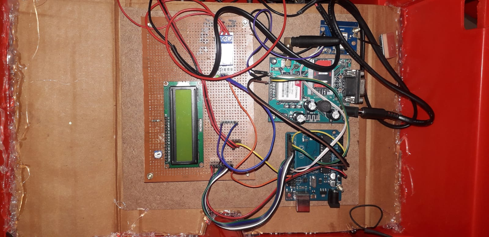

# Car Accident Alert and Emergency Response System

## Overview
This project aims to develop a system that detects car accidents using GPS data and sends emergency alerts via SMS to predefined contacts. The system will continuously monitor the vehicle's location and accelerometer data to detect sudden changes indicative of a potential accident. Upon detection, it will promptly notify emergency contacts with the accident location.

## Features
- Real-time monitoring of vehicle location using GPS.
- Accelerometer data analysis for detecting sudden impacts or changes.
- Automated SMS alerts to predefined emergency contacts.
- User-friendly interface for configuration and monitoring.

## Requirements
- Hardware:
  - GPS module compatible with the chosen microcontroller or single-board computer.
  - Accelerometer or gyroscope sensor for detecting vehicle motion.
  - Microcontroller or single-board computer (e.g., Arduino, Raspberry Pi).

## System Architecture

